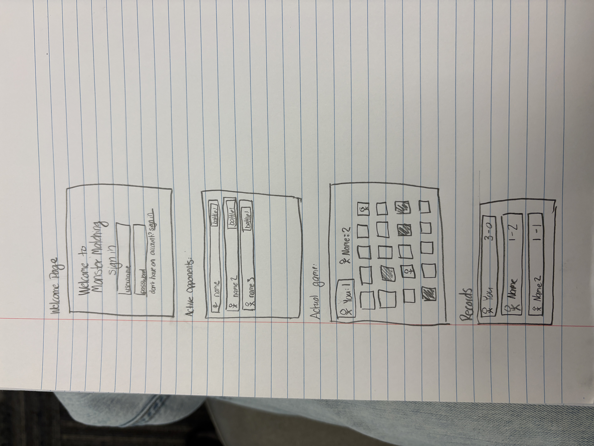
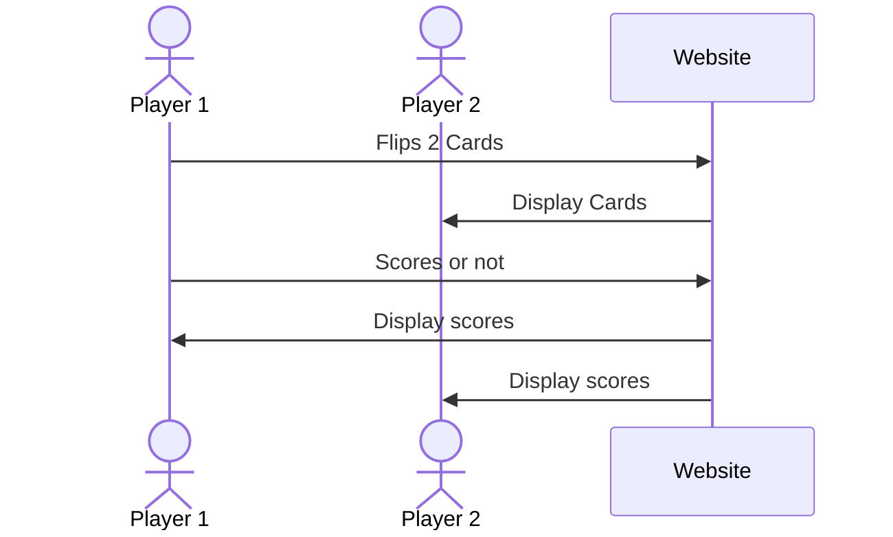

# Monster Matching

[My Notes](notes.md)

Put your memory to the test and see what monsters you can match!

## 🚀 Specification Deliverable

For this deliverable I did the following. I checked the box `[x]` and added a description for things I completed.

- [x] Proper use of Markdown
- [x] A concise and compelling elevator pitch
- [x] Description of key features
- [x] Description of how you will use each technology
- [x] One or more rough sketches of your application. Images must be embedded in this file using Markdown image references.

### Elevator pitch

Everyone's played the classic memory matching game. This is a fun, new twist. Play online against your friends to see who can remember the most monsters. Keep your brain sharp and have a blast competing in this friendly competition.

### Design

Here is a picture that shows the different screens that the game will have. 

### Key features

- Secure login
- Ability to choose an opponent
- Fun, interactive memory game
- Ability to play against an opponent in real time
- Record from each game played displayed

### Technologies

I am going to use the required technologies in the following ways.

- **HTML** - This will be the basic structure of the website. There will be 4 HTML pages. One for login, one for opponent selection, one for the game, and one for viewing the records.
- **CSS** - This will be used to make the website nice and pretty. There will be nice colors, spacing, formatting, and ensuring that it looks good on multiple screen sizes. 
- **React** - This is how I will make the game interactive, enabling users to flip cards. It will also keep track of the scores. 
- **Service** - This is how the website will save the game results and send information between the players. 
- **DB/Login** - This will store the user accounts and information such as scores. When users login, their scores will be saved so that they can view them later.
- **WebSocket** - Enable 2 browsers to talk to each other through the server, this will enable two people to play together at the same time.

## 🚀 AWS deliverable

For this deliverable I did the following. I checked the box `[x]` and added a description for things I completed.

- [x] **Server deployed and accessible with custom domain name** - [My server link](https://https://brooklyn-jones.click/).

My Public IPv4 address is 44.207.82.135

## 🚀 HTML deliverable

For this deliverable I did the following. I checked the box `[x]` and added a description for things I completed.

- [x] **HTML pages** - Added a home page, opponents page, players page, and scrores page
- [x] **Proper HTML element usage** - I used a wide variety of elements including bodys, headers, footers, 
 for line,   for spaces, spans, ps, hrefs, and other types for texts. There are also tables and lists to display information. 
- [x] **Links** - I did not complete this part of the deliverable. The headers have links to each page, and when you choose an opponent it takes you to the play page. 
- [x] **Text** - There is clear text to explain what everything does. There are headers and footers, and text displaying opponents. 
- [x] **3rd party API placeholder** - I used a third party api to randomly generate a new monster image each time the page is reloaded. The monster will show up in the tab. 
- [x] **Images** - The monster from the api is an image. There is also a table of pink boxes that represent the cards to flip over. 
- [x] **Login placeholder** - There is a login text box and a submit button.
- [x] **DB data placeholder** - The Opponents page has placeholders where all of the active opponents will be displayed. 
- [x] **WebSocket placeholder** - Placeholder for the two different players playing at the same time. It will switch back and forth between whos turn it is. 

## 🚀 CSS deliverable

For this deliverable I did the following. I checked the box `[x]` and added a description for things I completed.

- [ ] **Visually appealing colors and layout. No overflowing elements.** - I did not complete this part of the deliverable.
- [ ] **Use of a CSS framework** - I did not complete this part of the deliverable.
- [ ] **All visual elements styled using CSS** - I did not complete this part of the deliverable.
- [ ] **Responsive to window resizing using flexbox and/or grid display** - I did not complete this part of the deliverable.
- [ ] **Use of a imported font** - I did not complete this part of the deliverable.
- [ ] **Use of different types of selectors including element, class, ID, and pseudo selectors** - I did not complete this part of the deliverable.

## 🚀 React part 1: Routing deliverable

For this deliverable I did the following. I checked the box `[x]` and added a description for things I completed.

- [ ] **Bundled using Vite** - I did not complete this part of the deliverable.
- [ ] **Components** - I did not complete this part of the deliverable.
- [ ] **Router** - I did not complete this part of the deliverable.

## 🚀 React part 2: Reactivity deliverable

For this deliverable I did the following. I checked the box `[x]` and added a description for things I completed.

- [ ] **All functionality implemented or mocked out** - I did not complete this part of the deliverable.
- [ ] **Hooks** - I did not complete this part of the deliverable.

## 🚀 Service deliverable

For this deliverable I did the following. I checked the box `[x]` and added a description for things I completed.

- [ ] **Node.js/Express HTTP service** - I did not complete this part of the deliverable.
- [ ] **Static middleware for frontend** - I did not complete this part of the deliverable.
- [ ] **Calls to third party endpoints** - I did not complete this part of the deliverable.
- [ ] **Backend service endpoints** - I did not complete this part of the deliverable.
- [ ] **Frontend calls service endpoints** - I did not complete this part of the deliverable.
- [ ] **Supports registration, login, logout, and restricted endpoint** - I did not complete this part of the deliverable.

## 🚀 DB deliverable

For this deliverable I did the following. I checked the box `[x]` and added a description for things I completed.

- [ ] **Stores data in MongoDB** - I did not complete this part of the deliverable.
- [ ] **Stores credentials in MongoDB** - I did not complete this part of the deliverable.

## 🚀 WebSocket deliverable

For this deliverable I did the following. I checked the box `[x]` and added a description for things I completed.

- [ ] **Backend listens for WebSocket connection** - I did not complete this part of the deliverable.
- [ ] **Frontend makes WebSocket connection** - I did not complete this part of the deliverable.
- [ ] **Data sent over WebSocket connection** - I did not complete this part of the deliverable.
- [ ] **WebSocket data displayed** - I did not complete this part of the deliverable.
- [ ] **Application is fully functional** - I did not complete this part of the deliverable.
